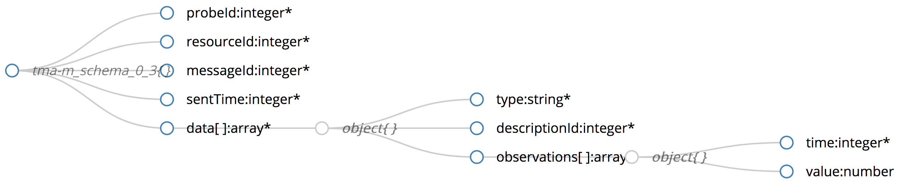

# Monitor Component @ TMA Framework

According to the [architecture of the TMA Framework](https://github.com/nmsa/tma-framework/blob/master/architecture/diagrams/TMA-Platform_Architecture.jpg)
the `TMA_Monitor` component provides a generic interface that can be used by the probes installed in the different layers of the system to send data about the collected measurements and events. 
These data are then stored in the `TMA_Knowledge` component, where it will be available to be used in by the `TMA_Analyze`, `TMA_Planning`, and `TMA_Execute` components.

The monitoring interface receives data regarding a **broad range of components in a generic fashion**.
To use this interface, the protocol defined [here](https://github.com/nmsa/tma-framework/blob/master/architecture/diagrams/TMA-M/TMA-M_sequence.jpg) must be foolowed, to assure the basic security properties in the data transmission (integrity and confidentiality). 

*Sequence diagram for the usage of the monitor component.*

Each probe starts its activity with an authentication synchronous message, in which it will receive is `probeId` and the token to use in the ensuing messages. 
All communication is performed over SSL sockets.
Each of the post observations interactions is an asynchronous message, which includes the obtained token in the headers. 
The messages format allows to aggregate multiple metrics and observations before sending, to avoid the communication overhead.

The [figure below](interface/atmosphere_tma-m_schema.png) presents the format of the messages to be submitted to the interface. 
Each message includes a `probeId` (obtained during authentication) and a `resourceId`, which identifies the resource that is the subject of the attached data. The `messageId` and `sentTime` are control information to avoid repeated messages.

*Format of the data to be provided to the monitor component.*

The message includes `data`, which is an array of objects. Each of these objects includes a `type` (event or measurement), a `descriptionId`, which identifies the event or measurement, and an array of `observations` (each one is a pair of time at which the specific observation was performed and respective value).

